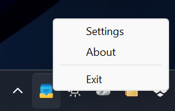
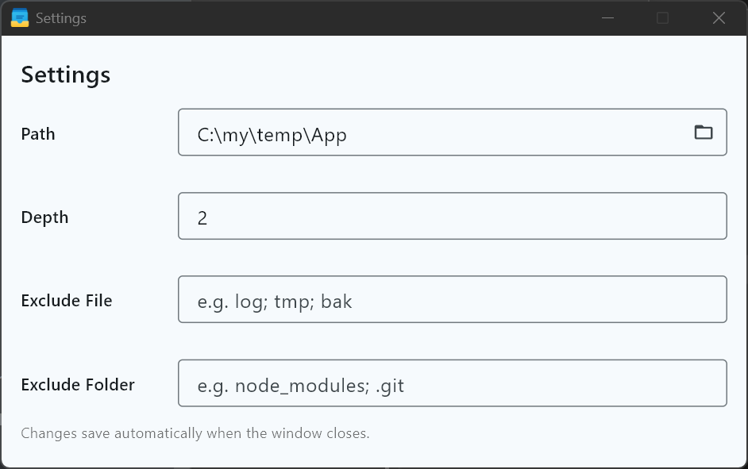

# ZenMenu

:rocket: Access frequently used data that you have created using folders in the toolbar.

## Intro

Assuming you have the following data structure consisting of folders and files stored in your SSD/HDD:

```ini
C:\TEMP
│   dd.pub
│   Downloads.xml.20230812.bak
│   InSpectre.exe
│   msvcp140_1.dll
│   New Bitmap image.bmp
│   New Microsoft Excel Worksheet.xlsx
│   New Text Document.txt
│   PP-UWP-Interop.dll
│   Yahoo奇摩.url
│
├───.git
├───New folder
│   │   Yahoo! ショッピング - LINEアカウント連携でPayPayポイント毎日5%！ネット通販.url
│   │
│   └───New folder
│           New Microsoft PowerPoint Presentation.pptx
│
├───New folder (2)
│       New Text Document.txt
│
├───node_modules
├───あ　あ　あ
│       01-01 - The Prelude - Reunion.flac
│       PP-UWP-Interop.dll
│
└───東方心綺楼-御首頂戴帳
```

Set `C:\TEMP` as the scan path, and then left-click the tray icon on the toolbar. You will get a nested list with the same structure, and you can click on the item in the list to open a folder or file.


> Nested list supporting mouse hover

## Guide

### Environment

- Windows 11

## Instruction

Download released package and install it. Running `zenmenu.exe` to run the app.

Pay attention to the tray icon at taskbar that the new icon showed.

Right-click mouse :

- Settings - Config app.
- About - Information about app.
- Exit - Exit app.



> Tray Icon & right-click menu

Click "Settings".

You can config the parameters of app:

- Path - the folder which you want to be a menu.
- Depth - the maxima scan depth of nested folder. It is recommended not to exceed 5.
- Exclude File - Filter based on the name at the end of the file. Filtered files will not appear in the menu. Multiple parameters can be separated by semicolons `;`.
- Exclude Folder - Filter based on the name at the end of the folder. Filtered folders will not appear in the menu. Multiple parameters can be separated by semicolons `;`.



> Settings


After config settings, left-click mouse and it shows the nested menu mapping to nested folder and files.

You can click any item and then the result depends on different types:

- Folder - Open the windows explorer by path.
- Files - Open the file with associated app.

Enjoy 😁

## Donate

[BTC]  bc1qd3889yxkk2tqjvxnxwa8qumr068htctat4ef3c

[ETH]  0xAF5e6b4a618238A9Bf202a78087f6F06351117e1

I'm a single, unmarried, veteran programmer (you know what I mean), and I need some money to take care of myself. If this program help you and willing to sponsor me to continue to improve this software, please support me with effective action.

## Sponsor

Thank you very much for your support!

2025/7/24 bc1q0-ljqy8 0.00016807 BTC
